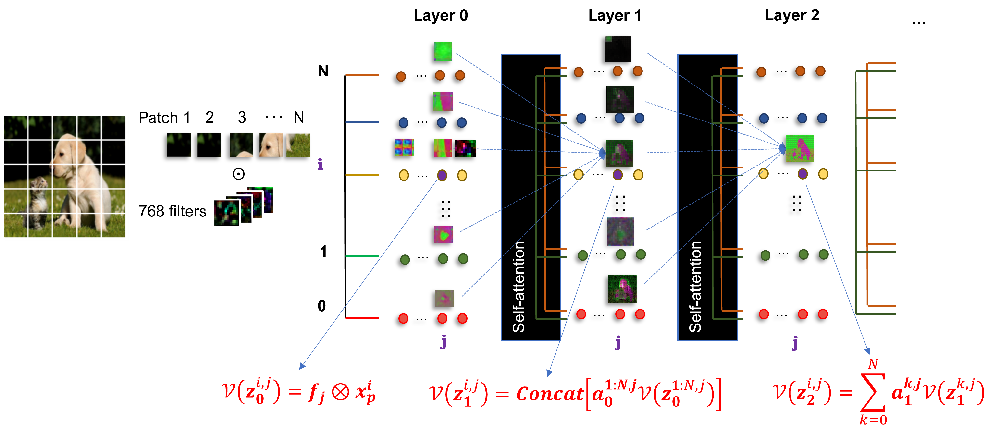
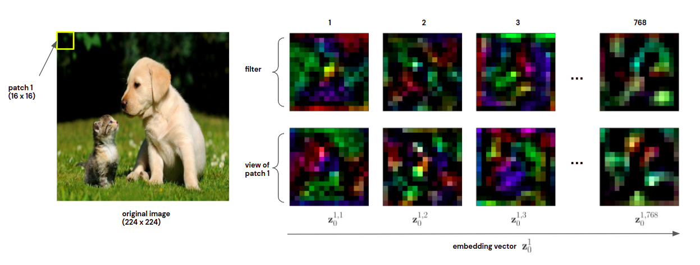
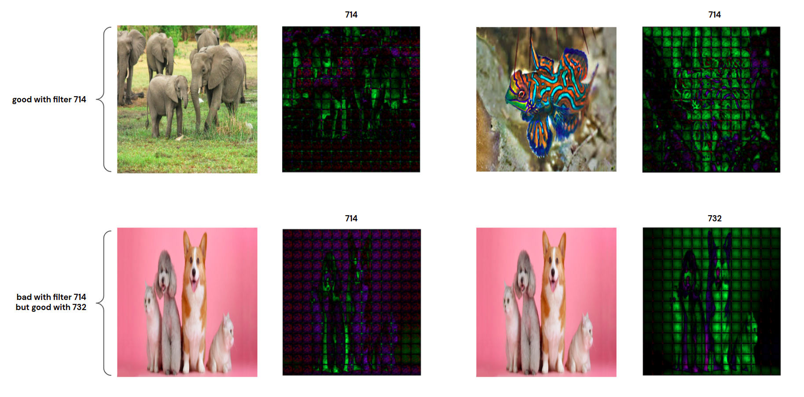
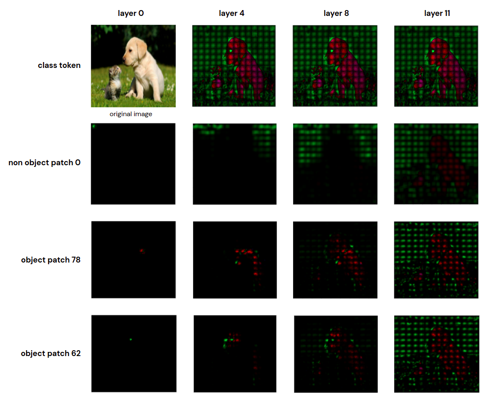
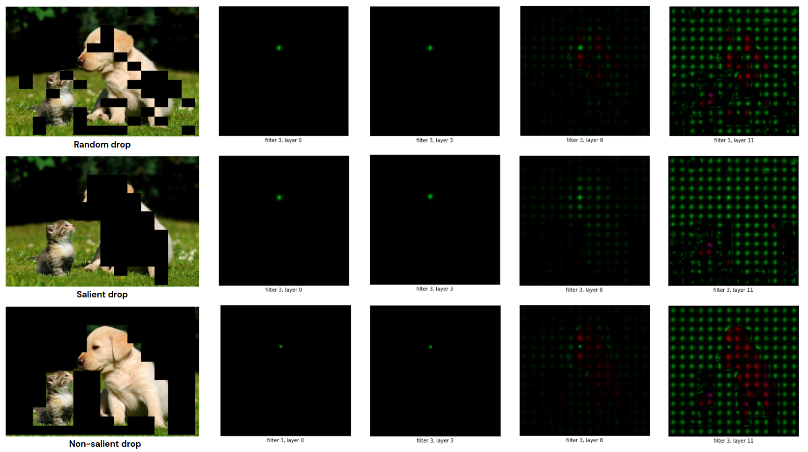
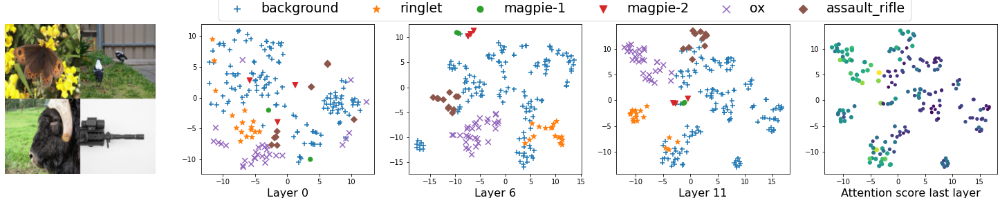

# Vision Transformer Visualization: What Neurons Tell and How Neurons Behave?
This is the official implementation of ViT visualization tool



## Prepare environment
The anaconda env file is `vit_visualize.yml`
To create the environment, please install `annaconda` first and then run:

`conda env create -f vit_visualize.yml`

To make the jupyter notebook could load the environment, run:

`python -m ipykernel install --user --name=vit_visual`

During this analysis we use model [Vision Transformer](https://github.com/google-research/vision_transformer) with version `ViT-B16/224`. To download the pretrain-weights of aforementioned model over `ImageNet21k + ImageNet2012` and save to `weights` folder, we should run the below bash commands:

```{bash}
mkdir -p weights
wget -O weights/ViT-B_16-224.npz /tmp/Ubuntu.iso https://storage.googleapis.com/vit_models/imagenet21k+imagenet2012/ViT-B_16-224.npz
```

## What Neurons Tell?

This [ViT_neuron_visualization](ViT_neuron_visualization.ipynb) notebook file includes the code we analyze the neuron's view that includes the below items according to the sector `What Neurons Tell` of the paper:

* Visualize filters and views of a specific input patche at 0'th layer:


<center></center>

* Comparing the views of different filters. Afterward, concluding that each filter is good for a specific group images but not good for the others group images.

<center></center>


* Create a global view at the higher layers and compare the global views corresponding with different patches.

<center></center>

* Analyze the views of salient, non-salient, and random occlusion cases over the depth-level layers.

<center></center>

## How Neurons Behave?
We implement the code the generate clustering behavior of embeddings in [ViT_embedding_visualization](ViT_embedding_visualization.ipynb) with full instruction to reproduce the result




