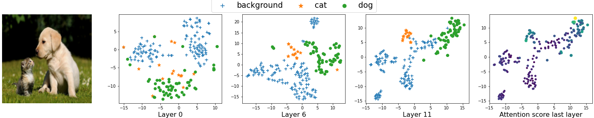

# Vision Transformer Visualization: What Neurons Tell and How Neurons Behave?
This is the official implementation of ViT visualization tool

## Prepare environment
The anaconda env file is `vit_visualize.yml`
To create the environment, please install `annaconda` first and then run:

`conda env create -f vit_visualize.yml`

To make the jupyter notebook could load the environment, run:

`python -m ipykernel install --user --name=vit_visual`
## What Neurons Tell?

This `ViT_neuron_visualization.ipynb` notebook file includes the code we analyze the neuron's view that includes the below items according to the sector `What Neurons Tell` of the paper:

* Create the input feature map at 0'th layer 
* Create a global view at the higher layers
* Compare global view corresponds with different patches.
* Analyze the views of salient, non-salient, and random occlusion over the depth of layers.

## How Neurons Behave?
We implement the code the generate clustering behavior of embeddings in `ViT_embedding_visualization.ipynb` with full instruction to reproduce the result

